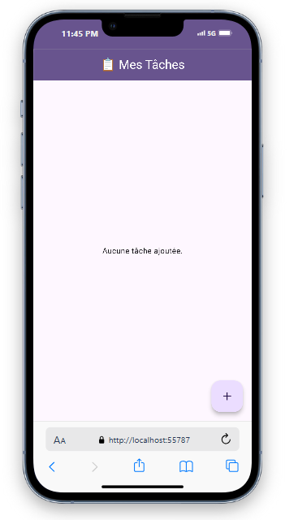
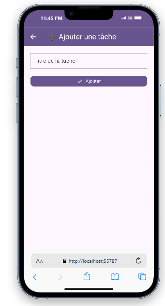
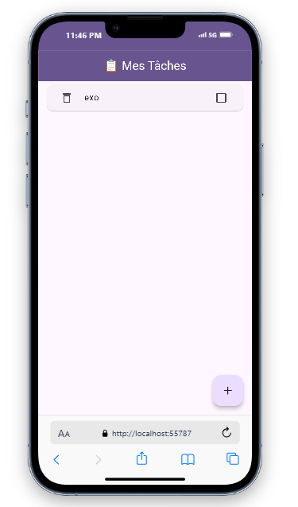

# Modern Todo App with Flutter

## Overview

This project is a simple yet modern Todo application built using Flutter. It incorporates essential features such as:

- Material You (Material 3) design language
- Dark and Light mode support
- Persistent local storage using SharedPreferences
- Smooth animations for better user experience
- Task management (add, mark as done, delete with undo)

## Features

- **Light/Dark Mode Support**: Dynamically adapts to system theme.
- **Persistent Storage**: Tasks are stored and retrieved using SharedPreferences.
- **Smooth Animations**: Animated page transitions and list item changes.
- **Swipe-to-Delete with Undo**: Users can remove tasks via swipe and undo changes using SnackBar.

## Screenshots

Here are some screenshots of the app in action:

### Home Screen



### Add Task Screen



### Screen



## Project Structure

```
lib/
├── main.dart              # App entry point and theme config
├── pages/
│   ├── home_page.dart     # Home screen displaying task list
│   └── add_task_page.dart # Screen for adding new tasks
pubspec.yaml               # Project dependencies
README.md                  # Full project report and documentation
```

## Getting Started

### Prerequisites

- Flutter SDK
- IDE (VS Code / Android Studio)

### Installation Steps

1. Clone the repository:

```bash
git clone https://github.com/yourusername/todo_app_flutter.git
cd todo_app_flutter
```

2. Install dependencies:

```bash
flutter pub get
```

3. Run the app:

```bash
flutter run
```

## Code Walkthrough

### main.dart

```dart
import 'package:flutter/material.dart';
import 'pages/home_page.dart';

void main() {
  runApp(const MyApp());
}

class MyApp extends StatelessWidget {
  const MyApp({super.key});

  @override
  Widget build(BuildContext context) {
    return MaterialApp(
      debugShowCheckedModeBanner: false,
      title: 'Todo App',
      theme: ThemeData(
        colorScheme: ColorScheme.fromSeed(seedColor: Colors.deepPurple),
        useMaterial3: true,
      ),
      darkTheme: ThemeData.dark().copyWith(
        colorScheme: ColorScheme.fromSeed(
          seedColor: Colors.deepPurple,
          brightness: Brightness.dark,
        ),
        useMaterial3: true,
      ),
      themeMode: ThemeMode.system,
      home: const HomePage(),
    );
  }
}
```

### home_page.dart

```dart
import 'dart:convert';
import 'package:flutter/material.dart';
import 'package:shared_preferences/shared_preferences.dart';
import 'add_task_page.dart';

class HomePage extends StatefulWidget {
  const HomePage({super.key});

  @override
  State<HomePage> createState() => _HomePageState();
}

class _HomePageState extends State<HomePage> {
  List<Map<String, dynamic>> tasks = [];

  void _loadTasks() async {
    final prefs = await SharedPreferences.getInstance();
    final String? tasksString = prefs.getString('tasks');
    if (tasksString != null) {
      setState(() {
        tasks = List<Map<String, dynamic>>.from(json.decode(tasksString));
      });
    }
  }

  void _saveTasks() async {
    final prefs = await SharedPreferences.getInstance();
    await prefs.setString('tasks', json.encode(tasks));
  }

  void _addTask(String newTitle) {
    setState(() {
      tasks.add({'title': newTitle, 'done': false});
    });
    _saveTasks();
  }

  void _deleteTask(int index) {
    final deletedTask = tasks.removeAt(index);
    _saveTasks();
    ScaffoldMessenger.of(context).showSnackBar(
      SnackBar(
        content: const Text("Task deleted"),
        action: SnackBarAction(
          label: "Undo",
          onPressed: () {
            setState(() {
              tasks.insert(index, deletedTask);
            });
            _saveTasks();
          },
        ),
      ),
    );
  }

  @override
  void initState() {
    super.initState();
    _loadTasks();
  }

  @override
  Widget build(BuildContext context) {
    return Scaffold(
      appBar: AppBar(
        title: const Text("📋 My Tasks"),
        centerTitle: true,
      ),
      body: ListView.builder(
        itemCount: tasks.length,
        itemBuilder: (context, index) {
          return Dismissible(
            key: Key(tasks[index]['title'] + index.toString()),
            direction: DismissDirection.endToStart,
            onDismissed: (_) => _deleteTask(index),
            background: Container(
              alignment: Alignment.centerRight,
              padding: const EdgeInsets.symmetric(horizontal: 20),
              color: Colors.red,
              child: const Icon(Icons.delete, color: Colors.white),
            ),
            child: Card(
              child: CheckboxListTile(
                title: Text(
                  tasks[index]['title'],
                  style: TextStyle(
                    decoration: tasks[index]['done']
                        ? TextDecoration.lineThrough
                        : null,
                  ),
                ),
                value: tasks[index]['done'],
                onChanged: (val) {
                  setState(() {
                    tasks[index]['done'] = val!;
                  });
                  _saveTasks();
                },
              ),
            ),
          );
        },
      ),
      floatingActionButton: FloatingActionButton(
        onPressed: () {
          Navigator.push(
            context,
            MaterialPageRoute(
              builder: (context) => AddTaskPage(onTaskAdded: _addTask),
            ),
          );
        },
        backgroundColor: Colors.deepPurple,
        child: const Icon(Icons.add),
      ),
    );
  }
}
```

### add_task_page.dart

```dart
import 'package:flutter/material.dart';

class AddTaskPage extends StatefulWidget {
  final Function(String) onTaskAdded;

  const AddTaskPage({super.key, required this.onTaskAdded});

  @override
  State<AddTaskPage> createState() => _AddTaskPageState();
}

class _AddTaskPageState extends State<AddTaskPage> {
  final TextEditingController _controller = TextEditingController();

  void _addTask() {
    final title = _controller.text.trim();
    if (title.isNotEmpty) {
      widget.onTaskAdded(title);
      Navigator.pop(context);
    }
  }

  @override
  Widget build(BuildContext context) {
    return Scaffold(
      appBar: AppBar(
        title: const Text("➕ Add a Task"),
      ),
      body: Padding(
        padding: const EdgeInsets.all(20.0),
        child: Column(
          children: [
            TextField(
              controller: _controller,
              decoration: const InputDecoration(
                labelText: "Task Title",
                border: OutlineInputBorder(),
              ),
              onSubmitted: (_) => _addTask(),
            ),
            const SizedBox(height: 20),
            ElevatedButton(
              onPressed: _addTask,
              child: const Text("Add Task"),
            ),
          ],
        ),
      ),
    );
  }
}
```

## Conclusion

This project showcases a beginner-friendly yet modern approach to building a Flutter app with essential features like task management, persistent data, animations, and responsive design. You can easily extend this app with more complex features like notifications, categorization, and syncing with cloud storage.
